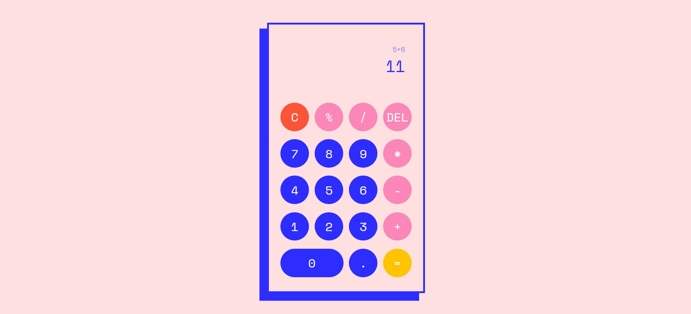
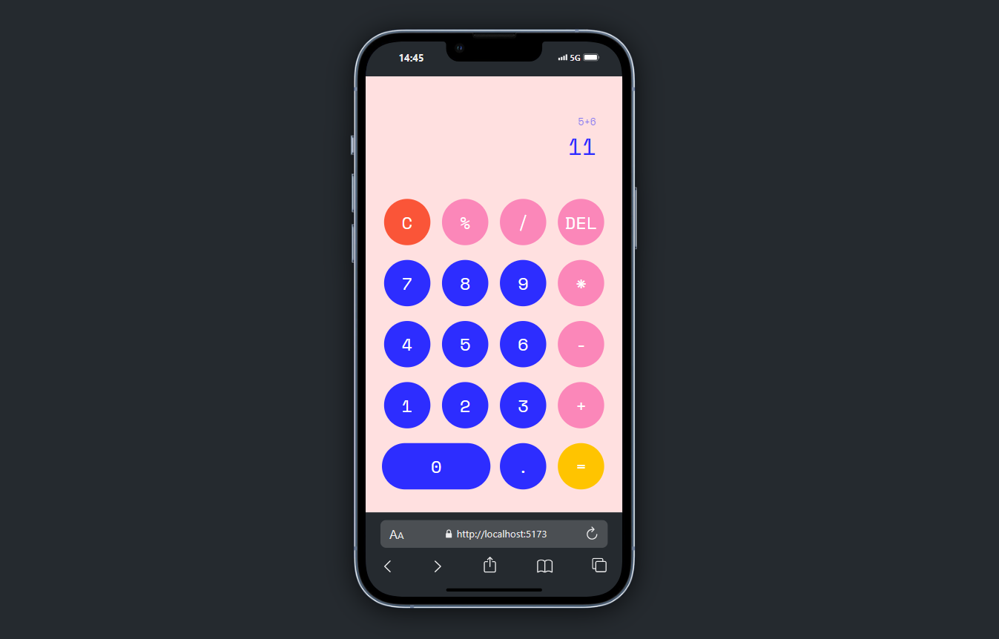
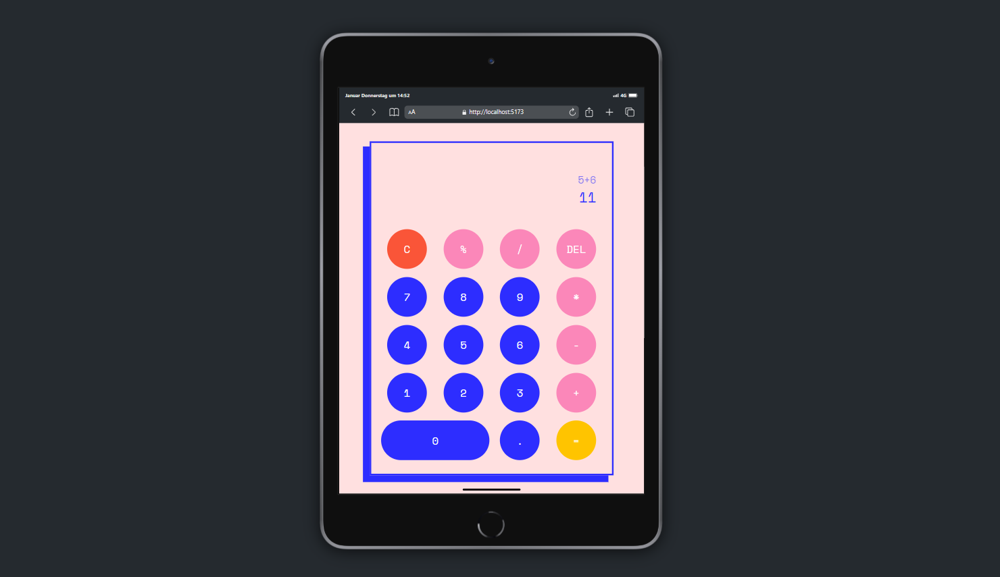

# Project Web Calculator

<div style="display: flex; justify-content: center;">
  
</div>
<br/>
<p>This project is a classic calculator, created during a 6-month web development bootcamp focusing on React.js and TypeScript. 

## Table of Contents 📑

- [About](#about)
- [Features](#features)
- [Tech Stack](#tech-stack)
- [Installation & Setup](#installation-&-setup)
- [Design](#design)

## About

<p>I created this project as a participant of a boot camp for web development focusing on React and Typescript. It was developed over the course of a single day in Visual Studio Code using HTML, CSS and Typescript.</p>

<p>The goal of this project was to spend the time deepening an understanding of Typescript functions in the framework of the second module of the bootcamp.</p>

<div style="display: flex; justify-content: space-between; align-items: center; width: 100%">
    
    
</div>

## Features
<ul>
  <li>Functions:
  <ul>
    <li>Addition, subtraction, division, multiplication, modulo</li>
    <li>Clear all, delete last input</li>
    <li>Solve operation and continue calculating with result</li>
    <li>Display last operation above result</li>
  </ul>
  </li>
  <li>Responsive design:
  <ul>
    <li>Optimised for different screens</li>
  </ul>
  </li>
</ul>

## Tech Stack

**Markup:**  
  
**Styling:**  
  
**Programming language:**  
  
**IDE:**  
  
**Version Control:**  
  

## Installation & Setup

You can check the calculator out <a href="https://bz-calculator-project.vercel.app/" title="See calculator in browser">here</a> in your local browser. To run the project locally, follow these steps:

1. **Clone the repository:**
   ```bash
   git clone https://github.com/bebzbzbz/Calculator-Project.git
   ```

2. **Install dependencies & run the development server:**
   ```bash
   npm install
   npm run dev
   ```

3. **Open your local host and enjoy!**

## Design

The playful, colourful design for this web calculator was inspired by both the flat, angular design of <a href="https://dribbble.com/shots/12909522--dailyui-Mortgage-Calculator" title="Sebastian Vigil - Mortgage Calculator">Sebastian Vigil's "Mortgage Calculator"</a>, as well as its vibrant blue, and the layout and colour assortment of <a href="https://dribbble.com/shots/15359416-MechaCalc-Calculator-App" title="Afrills - MechaCalc - Calculator App">Afrills' "MechaCalc - Calculator App"</a>. This combination makes for a modern look while 
ensuring a cohesive and visually appealing user experience.